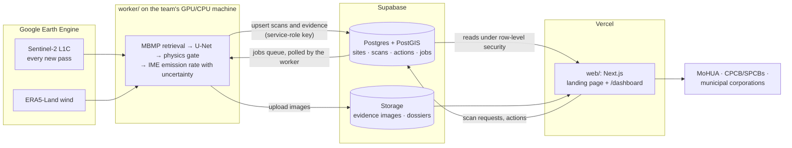

# VayuNetra

VayuNetra ("eye on the air") screens Indian landfills for methane in free Sentinel-2 imagery. On every
new pass over a site it runs the multi-band multi-pass (MBMP) methane retrieval, scores the scene with
a fine-tuned U-Net, sends each flag through a physics gate, estimates the emission rate in kg/h with an
uncertainty range, and writes an action dossier for MoHUA, CPCB/SPCBs and municipal corporations.
Methane warms about 80 times more than CO₂ over 20 years (IPCC AR6), and Maasakkers et al. (2022,
_Science Advances_) found landfill emissions in Delhi, Mumbai, Lahore and Buenos Aires 1.4–2.6× higher
than earlier estimates. VayuNetra is an entry for the Net Zero AI Architecture hackathon; team lead
Jiyad Hussain (Amity University, Noida).

Live site: https://vayunetra-india.vercel.app

[](https://www.youtube.com/watch?v=NFfkrmYtKDA)

The film, 4:54: [VayuNetra: India's Carbon Eyes](https://www.youtube.com/watch?v=NFfkrmYtKDA) (click the image to watch on YouTube).

> **Every satellite estimate in this repository is screening-grade.** Confirm it with a hyperspectral
> satellite, an OGI drone or a ground survey before enforcement or carbon crediting.

## Architecture



The worker makes outbound connections and opens no ports. It pulls imagery and wind from Earth
Engine, writes scans and evidence to Supabase with the service-role key, and polls the jobs table for
scan requests made on the dashboard. The website reads from Supabase under row-level security; the
browser receives `NEXT_PUBLIC_*` values and no other keys.

## Repository layout

| Path         | Contents                                                                                                                         |
| ------------ | -------------------------------------------------------------------------------------------------------------------------------- |
| `web/`       | Next.js 15 (App Router, TypeScript, Tailwind CSS v4, shadcn/ui, next-intl with English and Hindi). Landing page and `/dashboard` |
| `worker/`    | Python 3.11 package `vayunetra` with the `vayu` CLI. Inference worker                                                            |
| `video/`     | Remotion project for the 5-minute film (1920×1080, 30 fps)                                                                       |
| `supabase/`  | Supabase config, SQL migrations, RLS policies, seed script                                                                       |
| `data/seed/` | Ops notebook output: per-pass scans, site summary, confirmed events, tasking list, site dossiers                                 |
| `notebooks/` | `vayunetra_train.ipynb` (training) and `vayunetra_ops.ipynb` (India field test). The source of truth for the science             |
| `models/`    | Model weights zip. Gitignored                                                                                                    |

## Quickstart

Prerequisites: Node 24 with pnpm 10, Python 3.11 with [uv](https://docs.astral.sh/uv/), and for the
local database the Supabase CLI with Docker.

```bash
git clone https://github.com/Hussaincodes01/VaayuNetra.git
cd VaayuNetra
```

Website:

```bash
cd web
pnpm install
cp .env.example .env.local      # Supabase and Mapbox values
pnpm dev                        # http://localhost:3000, Hindi at /hi
```

Worker:

```bash
cd worker
uv sync --extra ee --extra api --extra pdf
uv pip install torch --index-url https://download.pytorch.org/whl/cu126   # or .../whl/cpu
uv pip install "segmentation-models-pytorch>=0.3.3"
cp .env.example .env            # the Earth Engine key file goes in secrets/, never in git
uv run pytest
uv run vayu scan --site deonar
```

The model weights are not in git. Put `vayunetra_best_model_20261001_1401.zip` in `models/`; the
worker finds it there. `worker/README.md` covers the CLI, Docker, systemd and Windows Task Scheduler.

Film:

```bash
cd video
pnpm install
pnpm dev                        # Remotion Studio
```

Local database:

```bash
node supabase/seed.ts           # regenerate supabase/seed.sql from data/seed/ (Node 24+)
supabase start                  # Postgres, Auth and Storage in Docker
supabase db reset               # migrations + seed: 10 sites, 674 scans
supabase test db                # pgTAP: RLS rules and site_stats against the field test
```

To seed a hosted project instead: `SUPABASE_URL=... SUPABASE_SERVICE_ROLE_KEY=... node supabase/seed.ts --remote`.

End-to-end tests (Playwright) run against a production build and the local database:

```bash
supabase start && supabase db reset
cd web
pnpm build && pnpm exec playwright install chromium
pnpm test:e2e                   # landing, public map, officer sign-in and scan request, access rules
```

CI in `.github/workflows/` runs ESLint, Prettier, the TypeScript check, the `server-only` guard and
`next build` for `web/`; pgTAP and the Playwright suite against a local Supabase in the runner; and
ruff and pytest for `worker/`. The latest Lighthouse reports are in `web/lighthouse/`.

Deployment, step by step: [DEPLOY.md](DEPLOY.md). Operations (restart the worker, rotate keys, re-run
a backfill, add a landfill): [RUNBOOK.md](RUNBOOK.md).

### Alerts and monthly reports

`web/vercel.json` schedules two Vercel Cron jobs. Both need `CRON_SECRET`, `SUPABASE_SERVICE_ROLE_KEY`,
`RESEND_API_KEY` and `ALERT_FROM_EMAIL` in the Vercel project, and recipients per state under
Dashboard, Settings.

| Route               | Schedule (UTC)                                      | What it sends                                                                                                                                                                                     |
| ------------------- | --------------------------------------------------- | ------------------------------------------------------------------------------------------------------------------------------------------------------------------------------------------------- |
| `/api/cron/alerts`  | every 15 min (GitHub Actions), daily 03:00 (Vercel) | One email per recipient for each new T1/T2 pass (pass date in the last 30 days) at a landfill in their state. Admins get one email per outage when a worker's heartbeat is more than 2 hours old. |
| `/api/cron/monthly` | 02:30 on the 1st (08:00 IST)                        | Per state: a PDF for the previous month (passes, T1/T2/T3, actions closed, minimum CO₂e estimate), stored in the private `reports` bucket and attached to the email.                              |

Each send is claimed in the database first (`alerts` unique on scan and channel, `ops_alerts`,
`reports`), so overlapping runs cannot email twice; a failed send is retried by the next run, up to
3 attempts. Recipients who are dashboard users get the email in their dashboard language.
WhatsApp/SMS through Twilio is off unless `ALERTS_TWILIO_ENABLED=true` and the `TWILIO_*` values
are set; numbers go in the `alert_phones` setting.

Vercel's Hobby plan runs a cron job at most once a day, so `web/vercel.json` runs the alerts job daily
as a backstop and `.github/workflows/alerts.yml` calls it every 15 minutes from GitHub Actions (setup
in DEPLOY.md step 4.5). Any scheduler can call the routes with the same bearer token:

```bash
curl -H "Authorization: Bearer $CRON_SECRET" https://vayunetra-india.vercel.app/api/cron/alerts
curl -H "Authorization: Bearer $CRON_SECRET" "https://vayunetra-india.vercel.app/api/cron/monthly?period=2025-01"
```

Staging check (the acceptance test): `web/scripts/alert-smoke.mjs` inserts a fake T1 scan, waits for
the cron or triggers it with `--trigger <host>`, prints the `alerts` row and deletes the fake scan.

```bash
cd web
SUPABASE_URL=... SUPABASE_SERVICE_ROLE_KEY=... node scripts/alert-smoke.mjs                 # waits up to 16 min
SUPABASE_URL=... SUPABASE_SERVICE_ROLE_KEY=... CRON_SECRET=... node scripts/alert-smoke.mjs --trigger https://<staging-host>
```

## Model

U-Net with a ResNet-50 encoder pretrained with SSL4EO-S12 (self-supervised on Sentinel-2), 33.9 M
parameters. It takes 17 input channels: the 13 Sentinel-2 L1C bands, reference SWIR1 and SWIR2, and 2
MBMP channels. Training data is MethaneSET: 3,552 real Sentinel-2 plume samples plus synthetic WRF-LES
plumes injected into real scenes. The model card sets the scene threshold at 0.844. Wind calibration is
U_eff = 0.140·U10 + 1.111, and emission rates use the integrated mass enhancement (IME) method.

## Global benchmark

Held-out test sites, VayuNetra against the classic MBMP method.

| Metric                                  | VayuNetra | Classic MBMP |
| --------------------------------------- | --------: | -----------: |
| ROC AUC                                 |     0.759 |        0.513 |
| Recall at 5% false-alarm rate           |      0.24 |         0.10 |
| Recall at 10% false-alarm rate          |      0.34 |         0.15 |
| Recall at 20% false-alarm rate          |      0.52 |         0.24 |
| Precision at the operating threshold    |     0.779 |        0.602 |
| Recall at the operating threshold       |     0.303 |        0.144 |
| False-alarm rate at operating threshold |      8.6% |         9.6% |
| Plume outline (pixel IoU)               |     0.312 |        0.077 |
| Recall, plumes < 1 t/h                  |      0.09 |         0.27 |
| Recall, plumes 3–5 t/h                  |      0.35 |         0.10 |
| Recall, plumes 5–10 t/h                 |      0.34 |         0.10 |
| Recall, plumes > 10 t/h                 |      0.37 |         0.06 |

Below 1 t/h the classic method recalls more plumes (0.27 against 0.09). For 58% of 839 real plumes,
the estimated emission rate falls within ±50% of the published MARS rate, with a median ratio of 1.02.
These rates are screening-grade.

## India field test, January 2024 to December 2025

Five landfills: Ghazipur, Bhalswa and Okhla in Delhi, Deonar in Mumbai and Pirana in Ahmedabad, each
paired with a control point 5 km away. The test covers 674 clear Sentinel-2 scenes, 340 over landfills
and 334 over controls.

The model flagged 14 landfill scenes and 0 of the 334 control scenes (p < 0.001). At the
India-calibrated threshold of 0.793 the counts become 31 of 340 against 4 of 334 (p ≈ 1e-6).

The physics gate sorted the 14 flags into three tiers. T1 is methane-confident, T2 is probable and
needs confirmation, T3 is surface change and is rejected as methane.

| Tier | Count | Events                                                                                                            |
| ---- | ----: | ----------------------------------------------------------------------------------------------------------------- |
| T1   |     1 | Deonar, 6 Jan 2025: ≈ 20.2 t/h (68% range 15.1–25.0), wind 5.1 m/s. Unconfirmed; queued for a hyperspectral check |
| T2   |     2 | Bhalswa, 18 May 2025: ≈ 19.1 t/h. Okhla, 29 Nov 2024: rate not estimated because the wind was calm (0.7 m/s)      |
| T3   |    11 | Surface change, 2 of them burn-like at Ghazipur                                                                   |

Persistent-emission upper bounds (95%): Ghazipur ≤ 5, Bhalswa ≤ 5, Deonar ≤ 10, Pirana ≤ 10 and
Okhla ≤ 20 t/h.

Over dense Indian landfills, per-pass detection is about 25–35% for plumes of 10 t/h or more. In a
known-truth test the estimated rate was 0.98× the injected rate at 10 t/h.

Deonar's minimum time-averaged rate is 301 kg/h, a minimum estimate of about 71,000 t CO₂e per year
(GWP100 = 27). The action plan assumes 60% gas capture; on that assumption it avoids about 41,900 t
CO₂e per year and supplies about 0.9 MW of electricity. Both figures change with the assumptions,
which are editable.

All rates above are screening-grade and need confirmation by a hyperspectral satellite, an OGI drone
or a ground survey before enforcement or carbon crediting.

Fine-tuning on Indian backgrounds did not improve held-out detection (AUC ≈ 0.55). The limit is the
Sentinel-2 signal against dense urban backgrounds, which is why VayuNetra is a two-tier system:
Sentinel-2 screens every new pass, and a confirmation tier checks what it flags.

## Data and credits

- **Copernicus Sentinel-2.** Contains modified Copernicus Sentinel data (2024–2025), accessed through
  Google Earth Engine.
- **ERA5-Land.** Wind from the Copernicus Climate Change Service (C3S), accessed through Google Earth
  Engine. Generated using Copernicus Climate Change Service information (2024–2025).
- **MethaneSET.** Training data, 3,552 real plume samples with targets from MARS-S2L. Licensed
  CC BY-NC-SA 4.0.
- **SSL4EO-S12.** Self-supervised Sentinel-2 pretraining for the ResNet-50 encoder.
- **UNEP IMEO MARS.** Published plume emission rates used for the rate comparison above.

Earth Engine is free for noncommercial and research use. Before an agency runs VayuNetra
operationally, check that the use fits the Earth Engine terms and register a commercial or government
licence if they require one.

## Licence

Code is released under the MIT licence; see [LICENSE](LICENSE). Data, imagery and model weights keep
their own licences and are not covered by the MIT licence.
